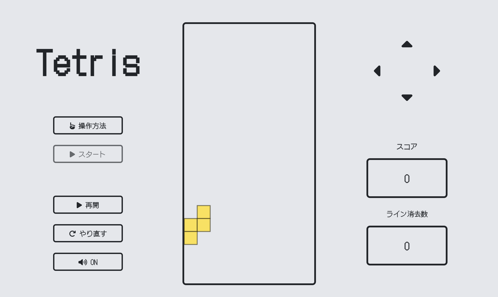

# 初級開発コース
## 成果物
テトリス

## 目的
- Gitの手順を再学習
- 技術向上を目指す

## 成果物開発の所感
最初、チーム内でもテトリスの実装のイメージが沸かなかったため、ChatGPT、記事など参考し、機能洗い出しから行なった。
実装の流れを掴んだところで、Notionを用いて、機能実装の一覧を作成。
これを用いて役割分担をしたが、Notionは活動において非常に有効であったと考える。
途中、メンバーが実装できないところを他のメンバーが変わって実装するなど、チームプレーは発揮していた。
このようなルーティンからメンバーの協力もあり、テトリスを完成させることができた。
最後にチームの雰囲気も非常に良く、良質な意見交換が出来、心理的安全性が非常に高いチームであった。

## 苦労したところ
- 各人別ファイルで作業していたので、コードの統合が煩雑さを要した
- HTMLでデザイン崩れが起きた
- ボタン機能
- 次のテトリミノ表示

## 活動内容
## スケジュール
- 10月18日(水)　テトリスの機能設定
- 10月19日(木)　
- 10月20日(金)　進捗率共有　oVice 22:00~
- 10月21日(土)
- 10月22日(日)　進捗率共有　oVice 9:00~
- 10月23日(月)
- 10月24日(火)　進捗率共有　oVice 22:00
- 10月25日(水)　課題完成（仮）進捗率共有　oVice 21:30
- 10月26日(木)　
- 10月27日(金)　デプロイ　進捗率共有　oVice 22:00
- 10月28日(土)　
- 10月29日(日)　課題提出

## 開発完了までのロードマップ
- ファイルの構成
- 要件定義（ロードマップ）
- 機能洗い出し
- 役割分担
- 機能実装
- マージ（テスト）
- デプロイ

## テトリスの機能一覧
1. ゲームボードの描画: テトリスのプレイエリアをHTML要素内に描画します。これはブロックが動き回るスペースです。
2. テトリミノの描画: テトリミノは異なる形状のブロックです。これらのテトリミノをHTML要素内に描画し、プレイヤーが操作できるようにします。
3. テトリミノの移動: プレイヤーがテトリミノを左右に移動できるようにし、落下速度を制御します。
4. テトリミノの回転: テトリミノの回転機能を実装し、プレイヤーがテトリミノの形状を変えられるようにします。
5. 衝突検出: テトリミノが他のテトリミノやゲームボードの壁に衝突した場合、それを検出し、適切なアクションを実行します。
6. 行のクリア: 一行がすべて埋まったら、その行を消去し、上にある行を下に詰めます。
7. 得点計算: プレイヤーが得点を獲得できるよう、行を消去した際に得点を追加します。
8. ゲームオーバーの検出: テトリミノがゲームボードの上部に達した場合や、新しいテトリミノを配置できない場合にゲームオーバーを宣言します。
9. ゲームコントロール: キーボードやマウスなどの入力を受け付け、テトリミノの操作とゲームの一時停止/再開を制御します。
10. ゲームの開始と再開: ゲームを開始するためのスタートボタンや、ゲームオーバー後に再開できるようにする機能を提供します。
11. デザインとアニメーション: ゲームボード、テトリミノ、得点、ゲームオーバーなどの要素をデザインし、アニメーションを追加してゲームを魅力的にします。
12. これらの要素は、簡単なテトリスゲームを作成するために必要な基本的な機能です。それぞれの要素を設計および実装し、HTML、CSS、JavaScriptを使用してゲームを完成させることができます。

## 機能
### HTML/CSS
- テトリスボード
- 操作方法ボタン
- スタートボタン
- ポーズボタン
- 再開ボタン
- やり直しボタン
- 十字キー
- スコア表示
- ライン消去数表示
### JavaScript
- テトリミノ作成（7種類）
- 操作：左右移動
- 操作：回転
- 操作：落下速度制御
- 衝突検出
- テトリミノ積み重ね
- ボタン機能：操作方法
- ボタン機能：スターボタン
- ボタン機能：ポーズボタン
- ボタン機能：再開ボタン
- ボタン機能：やり直しボタン
- モーダル
- 十字キー機能
- 行クリア
- ゲームオーバー機能
- テトリミノランダム選定
- スコア表示機能
- ライン消去数表示機能
- BGM機能

## 参考記事
- メイン：https://qiita.com/namakoRice/items/4933e77a41b2ac359229
- サ　ブ：https://tech.pjin.jp/blog/2021/08/01/js-tetoris/
